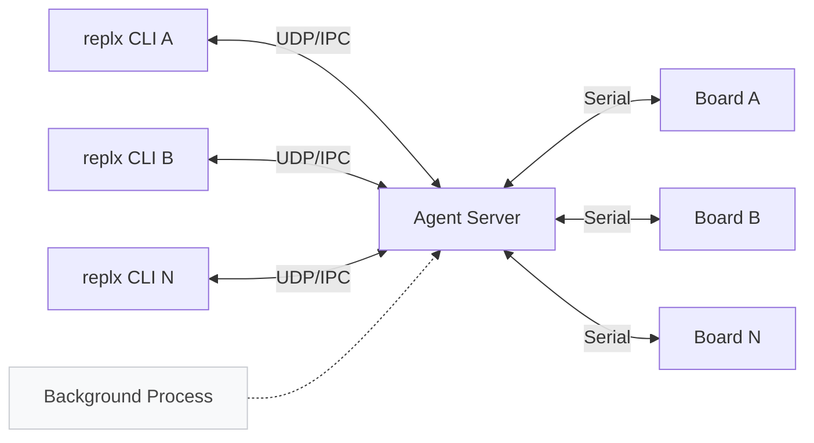
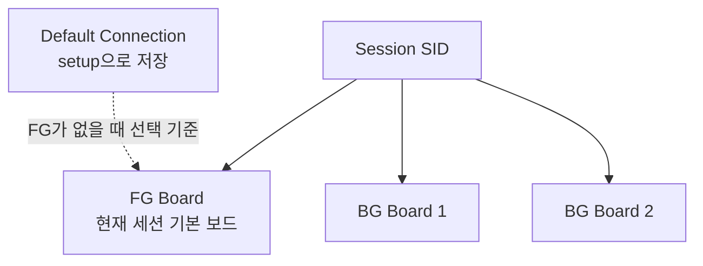
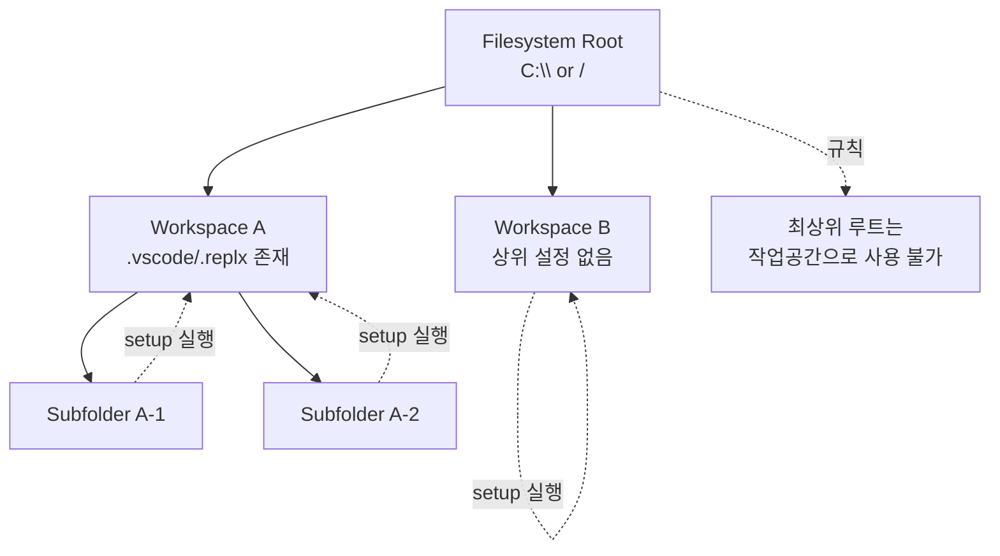
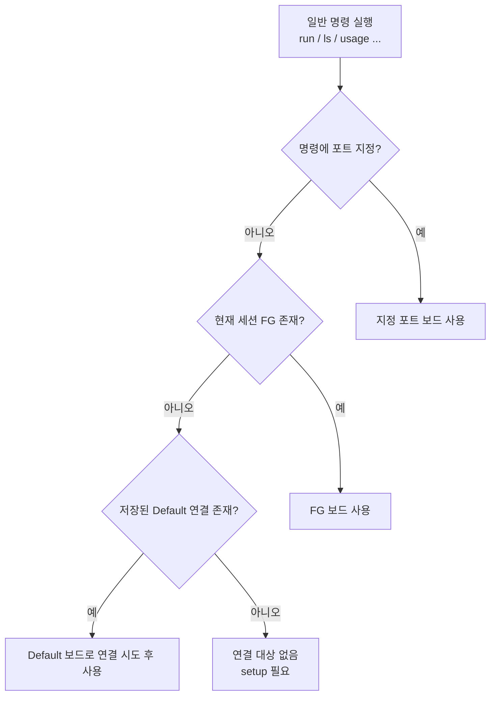

# replx

[](https://badge.fury.io/py/replx)
[](https://www.python.org/downloads/)
[](https://opensource.org/licenses/MIT)

`replx`는 MicroPython 개발 환경에서 에이전트 기반 아키텍처를 통해 여러 CLI 세션과 여러 보드를 동시에 연결·관리하여 연결 효율성과 병렬 작업성을 높인 CLI 도구입니다.

---

## 제1장. 전체 핵심 흐름



위 다이어그램은 `replx`의 핵심 구조를 보여줍니다. 사용자가 실행한 CLI 명령은 먼저 백그라운드의 Agent Server와 UDP/IPC로 통신하고, Agent Server가 실제 보드와 시리얼 통신을 담당합니다. 이 구조 덕분에 여러 터미널 세션에서 연결 상태를 공유하면서 FG/BG 전환, 상태 조회, 명령 실행을 일관되게 처리할 수 있습니다.

### 1-1. 먼저 이해할 용어: Session / FG / BG / Default

- **Session(SID)**: 터미널마다 생성되는 고유 작업 컨텍스트
- **FG(Foreground) 연결**: 현재 세션에서 기본 대상으로 사용하는 보드
- **BG(Background) 연결**: FG 외에 같은 세션에 추가로 붙인 보드
- **Default 연결**: `setup`으로 저장된 기본 보드 정보(포트 생략 시 재사용)



핵심 규칙은 간단합니다.

1. 한 세션에는 **FG 1개 + BG 여러 개**가 있을 수 있습니다.
2. FG 보드는 일반 명령에서 포트를 생략해도 사용할 수 있습니다.
3. BG 보드 대상으로 실행할 때는 반드시 포트를 명시해야 합니다.
4. `setup` 이후에는 저장된 기본 연결 정보를 기반으로 포트 생략 실행이 쉬워집니다.

### 1-2. setup과 작업공간(Workspace) 범위

`setup`은 단순 연결 명령이 아니라, **현재 VS Code 작업공간 기준**으로 개발 환경을 초기화하는 명령입니다.



1. `setup`을 실행하면 해당 작업공간에 대해 MicroPython 타입힌트, VS Code 설정, 기본 포트(Default 연결)가 설정됩니다.
2. 파일시스템 최상위 루트(`C:\`, `/`)는 작업공간으로 사용할 수 없습니다.
3. 작업공간은 하위 폴더를 가질 수 있으며, 하위 폴더에서 `setup`을 실행해도 설정은 상위 작업공간 범위에 반영됩니다.
4. 상위 경로에 작업공간 설정이 없으면 하위 경로들은 서로 다른 작업공간으로 취급됩니다. 따라서 각 작업공간은 각각 `setup`할 수 있고 기본 포트도 서로 다를 수 있습니다.

### 1-3. 명령이 어느 보드로 실행되는가

일반 명령(`run`, `ls`, `usage` 등)은 다음 흐름으로 대상을 결정합니다.



1. 명령에 포트를 명시했다면 해당 포트를 우선 사용
2. 포트가 없으면 현재 세션의 FG 보드를 사용
3. FG가 없으면 저장된 Default를 바탕으로 연결 시도

즉, **자주 쓰는 보드는 `setup`으로 기본화하고**, 필요할 때만 포트를 명시하면 됩니다.

포트 지정 예시는 다음 두 방식이 동일하게 동작합니다.

- `replx --port COM4 setup`
- `replx COM4 setup` (포트 단축 입력)

### 1-4. 먼저 구분할 두 가지 명령군

#### A) 포트 없이 동작하는 특수 명령
아래 명령은 보드 직접 조작보다 조회/관리 성격이 강해, 포트 없이 독립적으로 또는 세션 기준으로 동작합니다. 이 명령들에 `-p/--port`를 지정하면 오류로 처리됩니다.

- `replx scan` : 연결 가능한 보드 탐색(연결하지 않음)
- `replx status` : 세션/FG/BG 연결 상태 확인
- `replx whoami` : 현재 세션의 FG 보드 확인
- `replx shutdown` : 에이전트/연결 전체 종료
- `replx --help`, `replx COMMAND --help` : 도움말
- `replx -v` : 버전

#### B) 보드 연결이 필요한 일반 명령
아래 명령은 실제 보드와 통신합니다. `setup`을 제외하고, FG 또는 Default(FG로 자동 연결 시도)가 있으면 포트 생략이 가능합니다.

- 연결/세션: `setup`, `fg`, `disconnect`
- 실행/인터랙션: `exec`, `run`, `repl`, `shell`
- 파일: `ls`, `cat`, `get`, `put`, `cp`, `mv`, `rm`, `mkdir`, `touch`
- 보드: `usage`, `reset`, `format`, `init`, `wifi`, `firmware`
- 패키지/컴파일: `pkg`, `mpy`

---

### 1-5. 대표 사용 흐름 예시

#### 시나리오 1) 새 프로젝트 시작
1. `replx scan`으로 포트 확인
2. `replx COM4 setup`으로 워크스페이스 초기화 및 기본 연결 저장
3. `replx ls`로 기본 동작 확인

#### 시나리오 2) 여러 터미널/여러 보드 동시 사용
1. 터미널 A/B에서 각각 필요한 보드 연결
2. `replx status`로 SID별 FG/BG 상태 확인
3. 필요 시 `replx fg` 또는 `replx COM24 fg`로 전환

#### 시나리오 3) 코드 빠르게 실험
- 한 줄 실행: `replx -c "print('hello')"`
- 파일 실행: `replx run app.py`
- REPL 실행: `replx repl`

#### 시나리오 4) 파일/라이브러리 정리
- 파일 동기화: `put/get/ls/cat/...`
- 파일 작업용 보드 셸: `replx shell` (리눅스 셸 유사)
- 라이브러리 갱신: `replx pkg search` → `replx pkg download` → `replx pkg update core/`

#### 시나리오 5) 작업 종료/정리
- 포트만 해제: `replx disconnect`
- 전체 종료: `replx shutdown`

---

## 제2장. 기능별 명령 상세

이 장은 각 명령을 **사용자 입장**에서 설명합니다. 즉, “언제 쓰는가 → 실행하면 무엇이 바뀌는가 → 실수하기 쉬운 지점은 무엇인가” 순서로 자연스럽게 정리합니다.

### 2-1. 연결/세션 관리

#### `setup`
새 프로젝트를 시작하거나 작업 보드를 기본 대상으로 등록하고 싶을 때 사용하며, 개발 환경 초기화, 보드 연결, 타입힌트 배치, Default 포트 저장이 한 번에 수행됩니다. `clean`을 함께 사용하면 기존 연결 이력을 정리하고 현재 포트를 중심으로 다시 시작합니다. 만약 다른 포트로 다시 `setup`을 실행하면 기존 Default는 이력으로 바뀌고, 새로운 포트가 Default로 설정됩니다. 
`setup` 설정은 현재 작업공간 단위로 적용되며, 하위 폴더에서 실행해도 상위 작업공간 범위에 반영됩니다. 상위 경로에 설정이 없으면 각 하위 경로는 독립 작업공간으로 동작해 기본 포트가 서로 다를 수 있습니다.
파일시스템 최상위 루트(`C:\`, `/`)는 작업공간으로 사용할 수 없습니다.

**사용:**
```sh
replx PORT setup
replx PORT setup clean
```

**예제:**
```sh
replx COM3 setup
replx /dev/ttyACM0 setup
replx COM3 setup clean
```

#### `scan`
연결 전에 어떤 포트가 어떤 보드인지 먼저 확인할 때 사용하며, Port / Version / Core / Device / Manufacturer와 연결/기본 상태 아이콘을 보여줍니다.

**사용:**
```sh
replx scan
```

#### `status`
현재 세션(SID)과 FG/BG 연결 상태를 한 번에 확인할 때 사용하며, 세션별 연결, FG/BG 배치, 기본 연결 여부를 보여줍니다.

**사용:**
```sh
replx status
```

#### `fg`
지금 이 세션에서 기본으로 쓸 보드(FG)를 바꿀 때 사용합니다. `replx fg`는 연결 목록에서 대화형으로 FG 대상을 선택하고, `replx COM19 fg`는 현재 FG를 BG로 내린 뒤 `COM19`를 새 FG로 승격합니다.

**사용:**
```sh
replx fg
replx PORT fg
```

**예제:**
```sh
replx fg
replx COM19 fg
```

#### `whoami`
현재 터미널 세션의 FG가 무엇인지 즉시 확인할 때 사용합니다.

**사용:**
```sh
replx whoami
```

#### `disconnect`
에이전트는 유지한 채 특정 연결만 해제하고 싶을 때 사용합니다. `replx disconnect`는 현재 세션 기준 연결을 해제하고, `replx COM3 disconnect`는 지정 포트 연결만 선택 해제합니다.

**사용:**
```sh
replx disconnect
replx COM3 disconnect
```

#### `shutdown`
연결/세션 상태를 완전히 정리하고 처음 상태로 되돌리고 싶을 때 사용하며, 에이전트와 모든 연결이 종료됩니다. 이후 명령 실행 시 필요하면 자동으로 재시작/재연결됩니다. 이미 종료된 상태에서 다시 실행하면 "이미 종료됨" 안내가 표시됩니다.

**사용:**
```sh
replx shutdown
```

---

### 2-2. 실행/인터랙션

#### `exec` (`-c` 별칭)
파일을 만들지 않고 한 줄 코드를 즉시 시험할 때 사용하며, 보드에서 해당 코드를 1회 실행한 뒤 결과를 바로 출력합니다.

**사용:**
```sh
replx exec "CODE"
replx -c "CODE"
```

**예제:**
```sh
replx -c "print('hello')"
replx -c "import os; print(os.listdir())"
```

#### `run`
스크립트를 반복 실행하거나 자동화 작업을 돌릴 때 사용하며, 지정한 스크립트를 보드에서 실행합니다. `-d, --device`는 보드 저장소 파일을 실행할 때 사용하고, `-n, --non-interactive`는 detached 실행, `-e, --echo`는 입력 에코를 의미합니다. `--non-interactive`와 `--echo`는 함께 쓰지 않는 것을 권장합니다.

**사용:**
```sh
replx run SCRIPT
replx run -d SCRIPT
```

**예제:**
```sh
replx run main.py
replx run -d /lib/test.py
replx run -n server.py
```

#### `repl`
MicroPython 코드를 상호작용 방식으로 바로 입력/실행할 때 사용합니다. 기본 조작은 `Ctrl+C` 중단, `Ctrl+D` 소프트 리셋, `exit()` 종료입니다.

**사용:**
```sh
replx repl
```

#### `shell`
보드 파일을 탐색/정리/이동하는 작업을 대화형으로 빠르게 수행할 때 사용합니다. 이 명령은 코드 실행형 REPL이 아니라 리눅스 셸과 유사한 **파일 작업 중심 보드 셸**입니다.

**사용:**
```sh
replx shell
```

**셸 내부 주요 명령:**
```sh
# 파일
ls cat cp mv rm mkdir touch

# 탐색
cd pwd clear

# 실행 보조
exec run repl

# 기타
usage wifi help exit
```

---

### 2-3. 파일 작업

#### `ls`
경로 상태를 확인하거나 배포 전후 변경점을 비교할 때 사용합니다. `-r, --recursive`를 붙이면 하위 경로까지 조회합니다.

**사용:**
```sh
replx ls [PATH]
replx ls -r [PATH]
```

#### `cat`
보드 파일 내용을 빠르게 검토하거나 로그 텍스트를 점검할 때 사용합니다. `-n, --number`는 줄 번호 표시, `-L, --lines`는 특정 줄 범위 출력에 사용합니다. 텍스트는 UTF-8 기준으로 표시되며, 바이너리 또는 UTF-8로 해석되지 않는 내용은 hex 형식으로 출력됩니다.

**사용:**
```sh
replx cat FILE
replx cat -n FILE
replx cat -L N:M FILE
```

#### `get`
보드 파일/디렉터리를 로컬로 백업·동기화할 때 사용합니다. 와일드카드와 디렉터리 재귀 다운로드를 지원하며, 다중 소스일 때 마지막 인자 `LOCAL`은 디렉터리여야 합니다.

**사용:**
```sh
replx get REMOTE LOCAL
replx get REMOTE... LOCAL
```

#### `put`
로컬 변경 사항을 보드로 배포할 때 사용합니다. 와일드카드와 디렉터리 재귀 업로드를 지원하며, `put`의 패턴 해석은 로컬 기준입니다.

**사용:**
```sh
replx put LOCAL REMOTE
replx put LOCAL... REMOTE
```

#### `cp`
보드 내부에서 파일/디렉터리를 복제할 때 사용합니다. 디렉터리를 복사할 때는 `-r, --recursive`가 필요합니다.

**사용:**
```sh
replx cp SRC DEST
replx cp -r DIR DEST
```

#### `mv`
보드 내부에서 이름 변경 또는 경로 이동할 때 사용합니다. 디렉터리를 이동할 때는 `-r, --recursive`가 필요합니다.

**사용:**
```sh
replx mv SRC DEST
replx mv -r DIR DEST
```

#### `rm`
보드 정리 시 불필요 파일/디렉터리를 제거할 때 사용합니다. `-r, --recursive`는 디렉터리 삭제, `-f, --force`는 확인/오류 처리 완화에 사용하며, 복구가 어려우므로 삭제 전 `get` 백업을 권장합니다.

**사용:**
```sh
replx rm FILE
replx rm -r DIR
replx rm -f FILE
```

#### `mkdir`
배포 전에 보드 디렉터리 구조를 먼저 만들 때 사용합니다.

**사용:**
```sh
replx mkdir DIR
replx mkdir DIR...
```

#### `touch`
빈 파일 생성 또는 파일 존재 여부를 맞출 때 사용합니다.

**사용:**
```sh
replx touch FILE
replx touch FILE...
```

---

### 2-4. 보드 관리

#### `usage`
메모리/저장소 여유를 확인해 배포 가능성을 판단할 때 사용합니다.

**사용:**
```sh
replx usage
replx COM3 usage
```

#### `reset`
실행 상태를 초기화하거나 재연결 문제를 정리할 때 사용합니다. `--soft`는 인터프리터 재시작 중심이고, `--hard`는 하드웨어 리셋과 재연결까지 포함합니다.

**사용:**
```sh
replx reset
replx reset --soft
replx reset --hard
```

#### `format`
보드를 완전 초기화하고 파일시스템을 새로 시작할 때 사용합니다. `boot.py/main.py/lib`를 포함해 전체 삭제되므로 실행 전 백업을 권장합니다.

**사용:**
```sh
replx format
```

#### `init`
초기화 후 기본 라이브러리까지 한 번에 복구할 때 사용하며, 일반적으로 `format` 이후 코어/보드 라이브러리 재설치 흐름으로 동작합니다.

**사용:**
```sh
replx init
```

#### `wifi`
무선 연결 상태 확인, 접속, 자동 연결 정책 설정이 필요할 때 사용합니다.

**사용:**
```sh
replx wifi
replx wifi connect SSID PW
replx wifi connect
replx wifi scan
replx wifi off
replx wifi boot on|off
```

#### `firmware`
지원 보드의 펌웨어를 다운로드하거나 업데이트할 때 사용합니다. `-f, --force`는 강제 업데이트 옵션이며, 이 기능은 현재 ticle 계열에서만 사용할 수 있습니다.

**사용:**
```sh
replx firmware download
replx firmware update
replx firmware update -f
```

---

### 2-5. 패키지/컴파일

#### `pkg`
라이브러리 검색부터 로컬 저장소 갱신/정리까지 패키지 흐름을 관리할 때 사용하며, 기본 형태는 `replx pkg SUBCOMMAND [args]`입니다. `search [QUERY]`는 보드 범위에 맞는 패키지 검색, `download`는 로컬 저장소 메타/리소스 확보, `update TARGET`은 대상 경로(core/device/파일) 반영, `clean`은 캐시 정리에 사용합니다. `--owner`, `--repo`, `--ref`는 search/download 전용이고, `-t, --target`은 update 대상 지정, `--height`는 search 출력 높이 조절에 사용합니다.

**사용:**
```sh
replx pkg SUBCOMMAND [args]
```

**예제:**
```sh
replx pkg search
replx pkg search audio
replx pkg download
replx pkg update core/
replx pkg update device/
replx pkg update slip.py
replx pkg clean
```

> 참고: 현재 구현의 `pkg search/download`는 **현재 연결 보드의 core/device 범위**를 기준으로 동작합니다.

#### `mpy`
배포 전 `.py`를 `.mpy`로 컴파일해 크기/로딩 효율을 관리할 때 사용합니다. `-o, --output`으로 출력 파일을 지정할 수 있고, 연결된 보드 정보를 기반으로 아키텍처를 자동 선택합니다. 필요 시 `mpy-cross` 설치가 선행되어야 합니다.

**사용:**
```sh
replx mpy FILES...
replx mpy main.py -o out.mpy
```

---

## 제3장. 트러블슈팅 (실무 문제 해결 패턴)

### 3-1. 연결/세션 문제

| 증상 | 원인 후보 | 해결 절차 |
|---|---|---|
| `No active connections` | setup 미실행, 에이전트 중지 | `replx scan` → `replx PORT setup` → `replx status` |
| `Not connected` | 현재 세션 FG 없음 | `replx status`로 SID 확인 후 `replx fg` 또는 `replx PORT fg` |
| 다른 터미널에서 보드가 바쁘다고 표시 | 다른 SID가 FG/BG로 사용 중 | 해당 터미널에서 작업 종료 또는 `disconnect`, 필요 시 `shutdown` |
| 포트가 계속 점유됨 | 에이전트 유지 상태 | `replx disconnect`(개별) 또는 `replx shutdown`(전체) |

### 3-2. 실행 문제 (`exec/run/repl/shell`)

| 증상 | 원인 후보 | 해결 절차 |
|---|---|---|
| `run`이 즉시 실패 | 파일 경로 오입력 | 로컬 실행은 `run file.py`, 보드 파일은 `run -d /path/file.py` 구분 |
| `--non-interactive`와 `--echo` 충돌 | 옵션 조합 오류 | 둘 중 하나만 사용 |
| REPL에서 빠져나오기 어려움 | 종료 명령 미인지 | `exit()` 입력 또는 `Ctrl+D` |
| shell에서 예상 경로가 아님 | 현재 디렉터리 혼동 | `pwd` 확인 후 `cd` 이동 |

### 3-3. 파일 작업 문제

| 증상 | 원인 후보 | 해결 절차 |
|---|---|---|
| wildcard가 기대와 다름 | 로컬 확장/보드 확장 차이 | `put`은 로컬 기준, `get/rm/cp/mv`는 보드 측 패턴 처리 확인 |
| 디렉터리 복사/이동 실패 | `-r` 누락 | `cp -r`, `mv -r`, `rm -r` 사용 |
| 여러 파일 대상인데 목적지가 파일 | 마지막 인자 규칙 미숙지 | 마지막 인자는 항상 DEST, 다중 소스일 때 DEST는 디렉터리 |
| 삭제 후 복구 불가 | 백업 부재 | 삭제 전 `replx get`으로 백업 습관화 |

### 3-4. 패키지/컴파일 문제

| 증상 | 원인 후보 | 해결 절차 |
|---|---|---|
| `pkg search` 결과가 없음 | 현재 보드 core/device 범위에 없음 | 현재 보드 확인(`whoami`), 보드 전환 후 재검색 |
| `pkg update` 실패 | local store 미준비 | `replx pkg download` 선행 후 `replx pkg update ...` |
| `mpy` 실패 | `mpy-cross` 미설치 | `pip install mpy-cross` |
| 아키텍처 오류 | 보드 연결 정보 누락 | 먼저 연결 상태 확보(`setup` 또는 자동 연결 확인) |

### 3-5. 포맷/초기화/펌웨어 문제

| 증상 | 원인 후보 | 해결 절차 |
|---|---|---|
| `format/init` 후 코드 소실 | 정상 동작(전체 삭제) | 포맷 전 `get`으로 백업, 이후 `put/pkg update`로 복원 |
| `firmware` 미지원 오류 | 보드 비지원 | 지원 보드인지 확인 후 사용 (`ticle-*` 계열 중심) |
| `wifi connect` 실패 | SSID/PW 오류, AP 가시성 문제 | `wifi scan` → 재입력 → 필요 시 `wifi off` 후 재시도 |

---

## 빠른 참조

```bash
replx --help
replx COMMAND --help
replx pkg --help
replx wifi --help
replx firmware --help
```

문서와 실제 동작이 다르게 보이면, **항상 위 help 출력이 우선**입니다.
