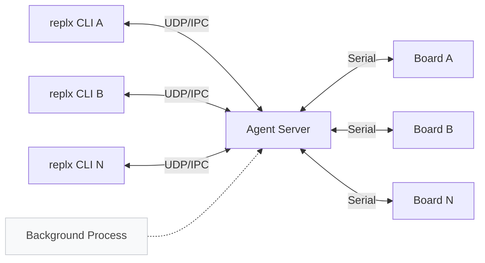
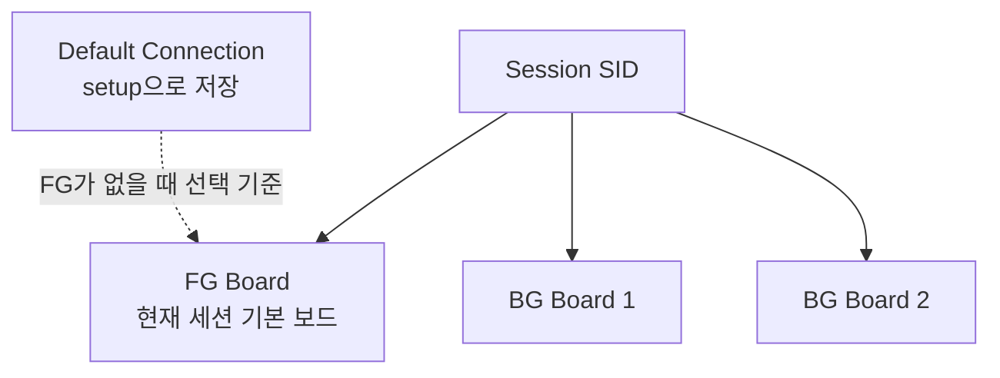
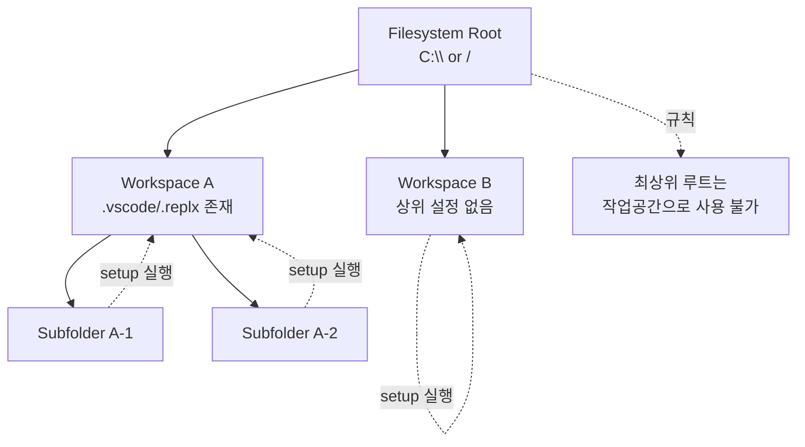
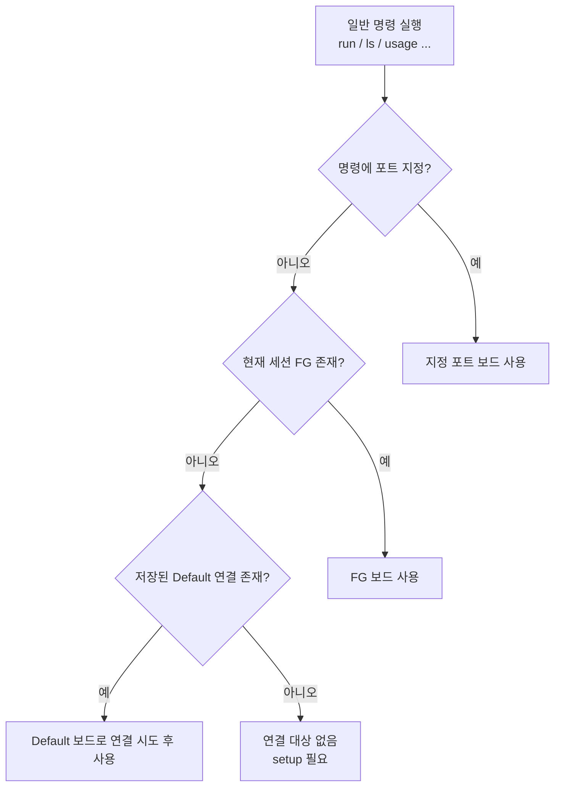

# replx

[](https://badge.fury.io/py/replx)
[](https://www.python.org/downloads/)
[](https://opensource.org/licenses/MIT)

`replx`는 MicroPython 개발 환경에서 에이전트 기반 아키텍처를 통해 여러 CLI 세션과 여러 보드를 동시에 연결·관리하여 연결 효율성과 병렬 작업성을 높인 CLI 도구입니다.

---

## 전체 핵심 흐름



위 다이어그램은 `replx`의 핵심 구조를 보여줍니다. 사용자가 실행한 CLI 명령은 먼저 백그라운드의 Agent Server와 UDP/IPC로 통신하고, Agent Server가 실제 보드와 시리얼 통신을 담당합니다. 이 구조 덕분에 여러 터미널 세션에서 연결 상태를 공유하면서 FG/BG 전환, 상태 조회, 명령 실행을 일관되게 처리할 수 있습니다.

### Session / FG / BG / Default

- **Session(SID)**: 터미널마다 생성되는 고유 작업 컨텍스트
- **FG(Foreground) 연결**: 현재 세션에서 기본 대상으로 사용하는 보드
- **BG(Background) 연결**: FG 외에 같은 세션에 추가로 붙인 보드
- **Default 연결**: `setup`으로 저장된 기본 보드 정보(포트 생략 시 재사용)



핵심 규칙은 간단합니다.

1. 한 세션에는 **FG 1개 + BG 여러 개**가 있을 수 있습니다.
2. FG 보드는 일반 명령에서 포트를 생략해도 사용할 수 있습니다.
3. BG 보드 대상으로 실행할 때는 반드시 포트를 명시해야 합니다.
4. `setup` 이후에는 저장된 기본 연결 정보를 기반으로 포트 생략 실행이 쉬워집니다.

### setup과 작업공간(Workspace) 범위

`setup`은 단순 연결 명령이 아니라, **현재 VS Code 작업공간 기준**으로 개발 환경을 초기화하는 명령입니다.



1. `setup`을 실행하면 해당 작업공간에 대해 MicroPython 타입힌트, VS Code 설정, 기본 포트(Default 연결)가 설정됩니다.
2. 파일시스템 최상위 루트(`C:\`, `/`)는 작업공간으로 사용할 수 없습니다.
3. 작업공간은 하위 폴더를 가질 수 있으며, 하위 폴더에서 `setup`을 실행해도 설정은 상위 작업공간 범위에 반영됩니다.
4. 상위 경로에 작업공간 설정이 없으면 하위 경로들은 서로 다른 작업공간으로 취급됩니다. 따라서 각 작업공간은 각각 `setup`할 수 있고 기본 포트도 서로 다를 수 있습니다.

### 명령이 어느 보드로 실행되는가?

일반 명령(`run`, `ls`, `usage` 등)은 다음 흐름으로 대상을 결정합니다.



1. 명령에 포트를 명시했다면 해당 포트를 우선 사용
2. 포트가 없으면 현재 세션의 FG 보드를 사용
3. FG가 없으면 저장된 Default를 바탕으로 연결 시도

즉, **자주 쓰는 보드는 `setup`으로 기본화하고**, 필요할 때만 포트를 명시하면 됩니다.

포트 지정 예시는 다음 두 방식이 동일하게 동작합니다.

- `replx --port PORT setup`
- `replx PORT setup` (포트 단축 입력)

여기서 `PORT`는 OS에 따라 다릅니다.
- Windows: `COM4`
- Linux: `/dev/ttyACM0` 또는 `/dev/ttyUSB0`
- macOS: `/dev/cu.usbmodem14101` 또는 `/dev/cu.usbserial-0001`

### 두 가지 명령군

#### 포트 없이 동작하는 특수 명령
아래 명령은 보드 직접 조작보다 조회/관리 성격이 강해, 포트 없이 독립적으로 또는 세션 기준으로 동작합니다. 이 명령들에 `-p/--port`를 지정하면 오류로 처리됩니다.

- `replx scan` : 연결 가능한 보드 탐색(연결하지 않음)
- `replx status` : 세션/FG/BG 연결 상태 확인
- `replx whoami` : 현재 세션의 FG 보드 확인
- `replx shutdown` : 에이전트/연결 전체 종료
- `replx --help`, `replx COMMAND --help` : 도움말
- `replx -v` : 버전

#### 보드 연결이 필요한 일반 명령
아래 명령은 실제 보드와 통신합니다. `setup`을 제외하고, FG 또는 Default(FG로 자동 연결 시도)가 있으면 포트 생략이 가능합니다.

- 연결/세션: `setup`, `fg`, `disconnect`
- 실행/인터랙션: `exec`, `run`, `repl`, `shell`
- 파일: `ls`, `cat`, `get`, `put`, `cp`, `mv`, `rm`, `mkdir`, `touch`
- 보드: `usage`, `reset`, `format`, `init`, `wifi`, `firmware`
- 패키지/컴파일: `pkg`, `mpy`

---

### 사용 흐름

#### 시나리오 #1 새 프로젝트 시작
1. `replx scan`으로 포트 확인
2. `replx PORT setup`으로 워크스페이스 초기화 및 기본 연결 저장
3. `replx ls`로 기본 동작 확인

#### 시나리오 #2 여러 터미널/여러 보드 동시 사용
1. 터미널 A/B에서 각각 필요한 보드 연결
2. `replx status`로 SID별 FG/BG 상태 확인
3. 필요 시 `replx fg` 또는 `replx PORT fg`로 전환

#### 시나리오 #3 코드 빠르게 실험
- 한 줄 실행: `replx -c "print('hello')"`
- 파일 실행: `replx run app.py`
- REPL 실행: `replx repl`

#### 시나리오 #4 파일/라이브러리 정리
- 파일 동기화: `put/get/ls/cat/...`
- 파일 작업용 보드 셸: `replx shell` (리눅스 셸 유사)
- 라이브러리 갱신: `replx pkg search` → `replx pkg download` → `replx pkg update core/`

#### 시나리오 #5 작업 종료/정리
- 포트만 해제: `replx disconnect`
- 전체 종료: `replx shutdown`

---

## 기능별 명령 상세

### 전체 명령 요약

#### 연결/세션

| 명령 | 용도 |
|---|---|
| `setup` | 작업 보드를 기본 대상으로 등록하고 개발 환경을 초기화합니다. |
| `scan` | 연결 가능한 포트와 보드 정보를 확인합니다. |
| `status` | 세션별 FG/BG 및 기본 연결 상태를 확인합니다. |
| `fg` | 현재 세션의 FG 보드를 전환합니다. |
| `whoami` | 현재 세션에서 바라보는 FG 보드를 확인합니다. |
| `disconnect` | 현재 세션의 보드 연결을 해제합니다. |
| `shutdown` | 에이전트와 모든 세션 연결을 정리합니다. |

#### 실행/인터랙션

| 명령 | 용도 |
|---|---|
| `exec` (`-c`) | 짧은 Python 코드를 즉시 실행합니다. |
| `run` | 로컬 Python 파일을 보드에서 실행합니다. |
| `repl` | 인터랙티브 REPL 세션을 시작합니다. |
| `shell` | 보드 파일시스템 작업용 셸을 엽니다. |

#### 파일 작업

| 명령 | 용도 |
|---|---|
| `ls` | 보드 경로의 파일/디렉터리 목록을 확인합니다. |
| `cat` | 보드 파일 내용을 출력합니다. |
| `get` | 보드 파일을 로컬로 내려받습니다. |
| `put` | 로컬 파일을 보드로 업로드합니다. |
| `cp` | 보드 내부에서 파일/디렉터리를 복사합니다. |
| `mv` | 보드 내부에서 파일/디렉터리를 이동/이름변경합니다. |
| `rm` | 보드 파일/디렉터리를 삭제합니다. |
| `mkdir` | 보드에 디렉터리를 생성합니다. |
| `touch` | 빈 파일 생성 또는 타임스탬프 갱신을 수행합니다. |

#### 보드 관리

| 명령 | 용도 |
|---|---|
| `usage` | 저장공간 사용량과 여유 공간을 확인합니다. |
| `reset` | 보드를 소프트 리셋합니다. |
| `format` | 보드 파일시스템을 포맷합니다. |
| `init` | 보드에서 초기 설정 스크립트를 실행합니다. |
| `wifi` | Wi-Fi 설정/연결 상태를 관리합니다. |
| `firmware` | 펌웨어 정보 확인, 다운로드, 업데이트를 수행합니다. |

#### 패키지/컴파일

| 명령 | 용도 |
|---|---|
| `pkg` | 패키지 검색/다운로드/업데이트를 수행합니다. |
| `mpy` | `.py` 파일을 `.mpy`로 컴파일합니다. |

### 연결/세션 관리

#### `setup`
새 프로젝트를 시작할 때 가장 먼저 실행하는 명령입니다. 보드 연결 확인 후 `.vscode/tasks.json`, `.vscode/settings.json`, `.vscode/launch.json`을 생성하고, Pylance용 typehint 경로를 구성한 뒤 현재 포트를 작업공간 Default로 저장합니다. `setup`은 포트 지정이 필수이며, `clean`을 함께 사용하면 기존 연결 이력을 모두 지우고 현재 포트만 남깁니다.
`setup` 설정은 현재 작업공간 단위로 적용되며, 하위 폴더에서 실행해도 상위 작업공간 범위에 반영됩니다. 상위 경로에 설정이 없으면 각 하위 경로는 독립 작업공간으로 동작해 기본 포트가 서로 다를 수 있습니다.
파일시스템 최상위 루트(`C:\`, `/`)는 작업공간으로 사용할 수 없습니다.

사용:
```sh
replx PORT setup
replx PORT setup clean
```

예제:
```sh
replx COM3 setup
replx /dev/ttyACM0 setup
replx /dev/cu.usbmodem14101 setup
replx COM3 setup clean
```

#### `scan`
연결 전에 어떤 포트가 어떤 보드인지 확인할 때 사용합니다. 에이전트에 이미 연결된 포트와 새로 스캔된 포트를 합쳐 Port / Version / Core / Device / Manufacturer를 보여주며, 연결 중과 Default 상태를 함께 표시합니다.

사용:
```sh
replx scan
```

예제:
```sh
replx scan
replx COM3 setup                  # scan에서 확인한 포트로 setup
replx /dev/ttyACM0 setup          # Linux 예시
replx /dev/cu.usbmodem14101 setup # macOS 예시
```

참고:
- `scan`은 보드에 연결하지 않고 탐지만 수행합니다.
- `-p/--port` 옵션을 함께 사용하면 오류가 발생합니다.

#### `status`
멀티 터미널 환경에서 세션별 FG/BG 연결을 한 번에 점검할 때 사용합니다. 현재 세션, 각 세션의 foreground/background 포트, 기본 포트 표시를 함께 보여줍니다.

사용:
```sh
replx status
```

예제:
```sh
replx status
replx status                    # 현재 세션/전체 세션 연결 상태 확인
replx fg                        # 상태를 보고 foreground 전환
```

#### `fg`
현재 세션의 foreground 보드를 전환할 때 사용합니다. `replx fg`는 대화형 목록에서 선택하고, `replx PORT fg`는 지정 포트를 바로 FG로 올립니다. 전환 후 이후 명령(`ls`, `run`, `cat` 등)은 새 FG를 기준으로 동작합니다.

사용:
```sh
replx fg
replx PORT fg
```

예제:
```sh
replx fg
replx COM19 fg
replx /dev/ttyACM0 fg
replx /dev/cu.usbmodem14101 fg
```

#### `whoami`
현재 터미널 세션의 FG가 무엇인지 즉시 확인할 때 사용합니다.

사용:
```sh
replx whoami
```

예제:
```sh
replx whoami
replx COM3 fg && replx whoami   # FG 전환 후 대상 보드 재확인
```

#### `disconnect`
에이전트 프로세스는 유지한 채 특정 포트 연결만 끊고 싶을 때 사용합니다. `replx disconnect`는 현재 세션의 FG를 대상으로 하고, `replx PORT disconnect`는 지정 포트를 해제합니다. 연결이 해제되면 해당 포트는 참조 중이던 모든 세션에서 제거됩니다.
FG가 제거되면, BG 중 하나가 FG가 됩니다. 더이상 포트가 존재하지 않으면 에이전트가 종료합니다.

사용:
```sh
replx disconnect
replx PORT disconnect
```

예제:
```sh
replx disconnect
replx COM3 disconnect
replx /dev/ttyACM0 disconnect
replx /dev/cu.usbmodem14101 disconnect
```

#### `shutdown`
작업이 끝나서 세션/연결/에이전트를 한 번에 정리할 때 사용합니다. 실행 결과는 상태에 따라 달라지며, 정상 종료 시 `Shutdown Complete`, 이미 꺼진 상태면 `Already Shutdown`, 실패 시 `Shutdown Failed`를 표시합니다. 이후 명령을 실행하면 에이전트는 필요 시 다시 시작됩니다.

사용:
```sh
replx shutdown
```

예제:
```sh
replx shutdown
replx shutdown && replx status  # 종료 후 상태 확인
```

---

### 실행/인터랙션

#### `exec` (`-c` 별칭)
짧은 MicroPython 코드를 파일 없이 즉시 실행할 때 사용합니다. 내부적으로 `exec` 명령을 보드에 1회 전송하고 표준 출력을 바로 반환합니다. 여러 문장을 실행할 때는 세미콜론(`;`)으로 이어서 사용할 수 있습니다.

사용:
```sh
replx exec "CODE"
replx -c "CODE"
```

예제:
```sh
replx -c "print('hello')"
replx -c "import os; print(os.listdir())"
replx exec "import machine; print(machine.freq())"
replx -c "import time; time.sleep(1); print('done')"
```

#### `run`
스크립트를 실행할 때 쓰는 기본 명령입니다. 기본 모드는 로컬 파일을 보드에 전송해 대화형으로 실행하고, `-d/--device`를 주면 보드 저장소의 파일을 직접 대화형으로 실행합니다. `-n/--non-interactive`는 입출력 대기 없이 분리된 비대화형 실행이고, `-e/--echo`는 대화형 실행에서 입력을 터미널에 에코합니다. `--non-interactive`와 `--echo`는 동시에 사용할 수 없습니다.

사용:
```sh
replx run SCRIPT
replx run -d SCRIPT
replx SCRIPT
```

예제:
```sh
replx run main.py      
replx main.py          # .py 파일 단축 실행
replx run -d /test.py  # 보드의 /test.py 대화형 실행
replx run -n server.py # 비대화형 실행(입출력 대기 없음)
replx run -dn /main.py # 보드의 /main.py 비대화형 실행
```

#### `repl`
보드의 Friendly REPL에 직접 들어가 줄 단위로 코드를 실험할 때 사용합니다. 출력은 실시간으로 표시되며, `exit()` 입력으로 REPL 세션을 종료할 수 있습니다.

사용:
```sh
replx repl
```

예제:
```sh
replx repl
# REPL 내부 예시
>>> import os
>>> os.listdir()
>>> exit()
```

핵심 키:
- `Ctrl+C`: 실행 중 코드 인터럽트
- `Ctrl+D`: soft reset

#### `shell`
보드 파일을 연속으로 관리할 때 쓰는 대화형 셸입니다. `ls/cat/cp/mv/rm/mkdir/touch`와 `cd/pwd`를 현재 경로 기준으로 빠르게 실행할 수 있습니다. 이 모드는 Python REPL이 아니며, `run`은 항상 보드 파일 기준(`-d`)으로 동작하고 `-n/-e` 옵션은 셸 내부에서 사용할 수 없습니다.

사용:
```sh
replx shell
```

셸 내부 주요 명령:
```sh
# 파일
ls cat cp mv rm mkdir touch

# 탐색
cd pwd clear

# 실행 보조
exec run repl

# 기타
usage wifi help exit
```

예제:
```sh
replx shell
:/ > ls
:/ > cd lib
:/lib > cat boot.py
:/lib > exit
```
---

### 파일 작업

#### `ls`
보드 디렉터리 내용을 조회할 때 사용합니다. 기본은 단일 경로 목록, `-r/--recursive`는 트리 형태로 하위 경로까지 출력합니다. 폴더/파일 타입 아이콘과 크기 정보가 함께 표시되어 배포 전후 비교에 유용합니다.

사용:
```sh
replx ls [PATH]
replx ls -r [PATH]
```

예제:
```sh
replx ls
replx ls /lib
replx ls -r
replx ls -r /lib
```

#### `cat`
보드 파일 내용을 확인할 때 사용합니다. 텍스트 파일은 그대로 표시하고, 바이너리 파일은 hex 덤프로 표시합니다. `-n/--number`는 텍스트 줄 번호 표시, `-L/--lines`는 텍스트에서는 줄 범위(`N:M`), 바이너리에서는 바이트 범위(`N:M`, `N:+M`)로 동작합니다.

사용:
```sh
replx cat FILE
replx cat -n FILE
replx cat -L N:M FILE
```

예제:
```sh
replx cat main.py
replx cat -n /lib/audio.py
replx cat -L 1:30 boot.py
replx cat -L 100:+64 app.mpy
```

#### `get`
보드 파일/디렉터리를 로컬로 내려받을 때 사용합니다. 원격 패턴(`*`, `?`)은 보드 측에서 해석되며, 디렉터리는 재귀 다운로드됩니다. 여러 소스를 한 번에 받는 경우 마지막 인자 `LOCAL`은 반드시 디렉터리여야 합니다.

사용:
```sh
replx get REMOTE LOCAL
replx get REMOTE... LOCAL
```

예제:
```sh
replx get main.py ./
replx get / ./backup            # 보드 파일시스템 전체 백업
replx get /a.py /b.py ./
replx get /lib/*.mpy ./compiled
```

#### `put`
로컬 파일/폴더를 보드로 업로드할 때 사용합니다. 로컬 와일드카드(`*`, `?`)를 확장해 업로드하며, 디렉터리는 재귀로 전송됩니다. 마지막 인자는 항상 원격 대상 경로이며, 필요 시 원격 디렉터리를 자동 생성합니다.

사용:
```sh
replx put LOCAL REMOTE
replx put LOCAL... REMOTE
```

예제:
```sh
replx put main.py /
replx put ./lib/audio.py /lib
replx put a.py b.py /lib
replx put *.py /lib
```

#### `cp`
보드 내부에서 복사할 때 사용합니다. 단일 파일/디렉터리뿐 아니라 다중 소스와 패턴 복사도 지원합니다. 디렉터리를 포함하면 `-r/--recursive`가 필수이며, 다중 소스 복사에서는 목적지가 디렉터리여야 합니다.

사용:
```sh
replx cp SRC DEST
replx cp -r DIR DEST
```

예제:
```sh
replx cp /main.py /backup.py
replx cp x.py y.py /backup
replx cp /lib/*.mpy /backup
replx cp -r /lib /lib_backup
```

#### `mv`
보드 내부 경로 이동과 이름 변경에 사용합니다. 단일 이동뿐 아니라 다중 소스/패턴 이동도 가능하며, 디렉터리 이동 시 `-r/--recursive`가 필요합니다. 다중 소스 이동에서는 목적지가 디렉터리인지 먼저 확인해야 합니다.

사용:
```sh
replx mv SRC DEST
replx mv -r DIR DEST
```

예제:
```sh
replx mv /old.py /new.py
replx mv /main.py /backup
replx mv *.py /backup
replx mv -r /lib/audio /lib/sound
```

#### `rm`
보드 파일/디렉터리를 삭제할 때 사용합니다. 기본 동작은 삭제 전 확인 프롬프트를 띄우고, `-f/--force`를 주면 확인 없이 삭제합니다. 디렉터리 삭제는 `-r/--recursive`가 필요하며, 패턴 삭제(`*.py`, `/lib/*.mpy`)도 지원합니다.

사용:
```sh
replx rm FILE
replx rm -r DIR
replx rm -f FILE
```

예제:
```sh
replx rm /main.py
replx rm -f /main.py
replx rm /a.py /b.py
replx rm /lib/*.mpy
replx rm -rf /tmp
```

#### `mkdir`
보드에 디렉터리 구조를 미리 만들 때 사용합니다. 여러 경로를 한 번에 생성할 수 있고, 중첩 경로도 생성됩니다. 이미 존재하는 디렉터리는 경고 없이 유지됩니다.

사용:
```sh
replx mkdir DIR
replx mkdir DIR...
```

예제:
```sh
replx mkdir /lib
replx mkdir /tests
replx mkdir /lib/audio /lib/net
replx mkdir /a/b/c
```

#### `touch`
빈 파일을 만들거나 파일 존재 상태를 맞출 때 사용합니다. 여러 파일을 한 번에 처리할 수 있어 초기 템플릿 구성 시 유용합니다.

사용:
```sh
replx touch FILE
replx touch FILE...
```

예제:
```sh
replx touch /config.py
replx touch /a.py /b.py /c.py
replx touch /lib/__init__.py
```

---

### 보드 관리

#### `usage`
RAM(`mem`)과 파일시스템(`df`) 사용량을 동시에 확인할 때 사용합니다. 사용률 막대와 Used/Free/Total 수치를 함께 보여주므로 업로드 전 용량 점검에 적합합니다.

사용:
```sh
replx usage
replx PORT usage
```

예제:
```sh
replx usage
replx COM3 usage
replx /dev/ttyACM0 usage
replx /dev/cu.usbmodem14101 usage
```

#### `reset`
실행 상태를 초기화할 때 사용합니다. 기본은 `--soft`(인터프리터 재시작)이며, `--hard`는 하드웨어 리셋 후 재연결 흐름을 사용합니다. `--soft`와 `--hard`를 동시에 지정하면 에러가 발생합니다.

사용:
```sh
replx reset
replx reset --soft
replx reset --hard
```

예제:
```sh
replx reset
replx reset --soft
replx reset --hard
```

옵션 요약:
- `--soft`: Python 인터프리터 재시작(기본)
- `--hard`: 하드웨어 리셋 + 자동 재연결

#### `format`
보드 파일시스템을 완전히 비우고 다시 시작할 때 사용합니다. `boot.py`, `main.py`, `lib/`를 포함한 사용자 파일이 모두 삭제됩니다. 일부 보드는 포맷 명령을 지원하지 않을 수 있으므로 실패 메시지를 확인해야 합니다.

사용:
```sh
replx format
```

예제:
```sh
replx get /*.py ./backup
replx get /lib ./backup
replx format
```

#### `init`
보드를 초기 상태로 복구하면서 필수 라이브러리까지 다시 설치할 때 사용합니다. 내부적으로 `format` 후 core/device 패키지 설치를 순차 수행합니다. 실행 전 로컬 패키지 저장소가 준비되어 있어야 하므로, 처음 환경에서는 `replx pkg download`를 먼저 실행해야 합니다.

사용:
```sh
replx init
```

예제:
```sh
replx pkg download
replx init
```

동작 순서:
1. 파일시스템 포맷
2. core 라이브러리 설치
3. device 라이브러리 설치

#### `wifi`
보드의 Wi-Fi 상태 조회/연결/부팅 자동연결을 관리할 때 사용합니다. `wifi connect SSID PW`는 자격 정보를 보드(`wifi_config.py`)에 저장하고 즉시 연결하며, `wifi connect`는 저장된 설정으로 재연결합니다. `wifi boot on|off`는 `boot.py`의 자동 연결 동작을 켜거나 끕니다.

사용:
```sh
replx wifi
replx wifi connect SSID PW
replx wifi connect
replx wifi scan
replx wifi off
replx wifi boot on|off
```

예제:
```sh
replx wifi
replx wifi scan
replx wifi connect MySSID MyPassword
replx wifi connect
replx wifi boot on
replx wifi off
```

#### `firmware`
지원 보드의 펌웨어를 로컬에 다운로드하거나 UF2 방식으로 업데이트할 때 사용합니다. `download`는 로컬 저장소 갱신만 수행하고, `update`는 보드를 부트로더 모드로 전환한 뒤 UF2 드라이브를 찾아 설치를 진행합니다. `-f/--force`는 버전이 같아도 재설치하며, 현재 공식 지원 대상은 `ticle-lite`, `ticle-sensor`입니다.

사용:
```sh
replx firmware download
replx firmware update
replx firmware update -f
```

옵션 요약:
- `-f, --force`: 현재 버전과 동일해도 강제 재설치

예제:
```sh
replx firmware download
replx firmware update
replx firmware update --force
```

---

### 패키지/컴파일

#### `pkg`
깃허브 원격 저장소와 로컬 저장소 및 보드 사이 패키지 워크플로(`search → download → update`)를 관리하는 명령입니다. `search [QUERY]`는 현재 연결된 보드의 core/device 범위에서 결과를 보여주고, `download`는 원격 레지스트리를 로컬 저장소로 받습니다. `update TARGET`은 core/device/파일/폴더/URL 대상을 보드 경로로 반영하며, `clean`은 현재 보드 기준 로컬 저장소 항목을 정리합니다. args 중 `--owner/--repo/--ref`는 깃허브 원격 저장소 정보로 `search/download` 전용이며, `-t/--target`은 `update` 대상 경로 지정에 사용됩니다.

사용:
```sh
replx pkg SUBCOMMAND [args]
```

예제:
```sh
replx pkg search
replx pkg search audio
replx pkg search --owner PlanXLab --repo replx_libs --ref main
replx pkg download
replx pkg download --owner PlanXLab --repo replx_libs --ref main
replx pkg update core/
replx pkg update device/
replx pkg update slip.py
replx pkg update ws2812 --target lib/ticle
replx pkg update https://raw.githubusercontent.com/.../driver.py --target lib/ext
replx pkg clean
```

> 참고: `pkg search/download`는 **현재 연결 보드의 core/device 범위**를 기준으로 동작합니다.

#### `mpy`
`.py`를 `.mpy` 바이트코드로 컴파일할 때 사용합니다. 연결된 보드의 `core`/버전을 기반으로 타깃 아키텍처를 자동 선택하고, 단일 파일일 때만 `-o/--output`으로 출력 경로를 지정할 수 있습니다. 로컬에 `mpy-cross`가 없으면 컴파일 전에 설치가 필요합니다.

사용:
```sh
replx mpy FILES...
replx mpy main.py -o out.mpy
```

예제:
```sh
replx mpy main.py
replx mpy main.py -o build/main.mpy
replx mpy *.py
replx mpy src/
```

---

## 트러블슈팅

#### 연결/세션

| 증상 | 원인 후보 | 해결 절차 |
|---|---|---|
| `No active connections` | setup 미실행, 에이전트 중지 | `replx scan` → `replx PORT setup` → `replx status` |
| `Not connected` | 현재 세션 FG 없음 | `replx status`로 SID 확인 후 `replx fg` 또는 `replx PORT fg` |
| 다른 터미널에서 보드가 바쁘다고 표시 | 다른 SID가 FG/BG로 사용 중 | 해당 터미널에서 작업 종료 또는 `disconnect`, 필요 시 `shutdown` |
| 포트가 계속 점유됨 | 에이전트 유지 상태 | `replx disconnect`(개별) 또는 `replx shutdown`(전체) |

#### 실행 (`exec/run/repl/shell`)

| 증상 | 원인 후보 | 해결 절차 |
|---|---|---|
| `run`이 즉시 실패 | 파일 경로 오입력 | 로컬 실행은 `run file.py`, 보드 파일은 `run -d /path/file.py` 구분 |
| `--non-interactive`와 `--echo` 충돌 | 옵션 조합 오류 | 둘 중 하나만 사용 |
| REPL에서 빠져나오기 어려움 | 종료 명령 미인지 | `exit()` 입력 또는 `Ctrl+D` |
| shell에서 예상 경로가 아님 | 현재 디렉터리 혼동 | `pwd` 확인 후 `cd` 이동 |

#### 파일 작업

| 증상 | 원인 후보 | 해결 절차 |
|---|---|---|
| wildcard가 기대와 다름 | 로컬 확장/보드 확장 차이 | `put`은 로컬 기준, `get/rm/cp/mv`는 보드 측 패턴 처리 확인 |
| 디렉터리 복사/이동 실패 | `-r` 누락 | `cp -r`, `mv -r`, `rm -r` 사용 |
| 여러 파일 대상인데 목적지가 파일 | 마지막 인자 규칙 미숙지 | 마지막 인자는 항상 DEST, 다중 소스일 때 DEST는 디렉터리 |
| 삭제 후 복구 불가 | 백업 부재 | 삭제 전 `replx get`으로 백업 습관화 |

#### 패키지/컴파일

| 증상 | 원인 후보 | 해결 절차 |
|---|---|---|
| `pkg search` 결과가 없음 | 현재 보드 core/device 범위에 없음 | 현재 보드 확인(`whoami`), 보드 전환 후 재검색 |
| `pkg update` 실패 | local store 미준비 | `replx pkg download` 선행 후 `replx pkg update ...` |
| `mpy` 실패 | `mpy-cross` 미설치 | `pip install mpy-cross` |
| 아키텍처 오류 | 보드 연결 정보 누락 | 먼저 연결 상태 확보(`setup` 또는 자동 연결 확인) |

#### 포맷/초기화/펌웨어

| 증상 | 원인 후보 | 해결 절차 |
|---|---|---|
| `format/init` 후 코드 소실 | 정상 동작(전체 삭제) | 포맷 전 `get`으로 백업, 이후 `put/pkg update`로 복원 |
| `firmware` 미지원 오류 | 보드 비지원 | 지원 보드인지 확인 후 사용 (`ticle-*` 계열 중심) |
| `wifi connect` 실패 | SSID/PW 오류, AP 가시성 문제 | `wifi scan` → 재입력 → 필요 시 `wifi off` 후 재시도 |

---
