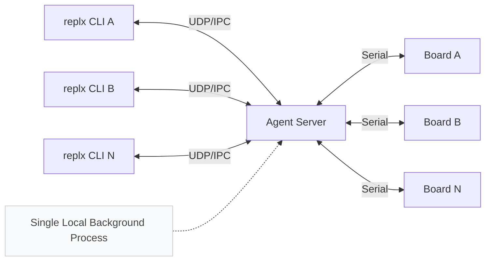
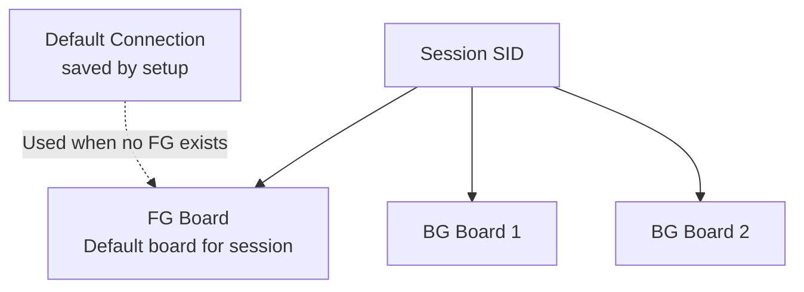
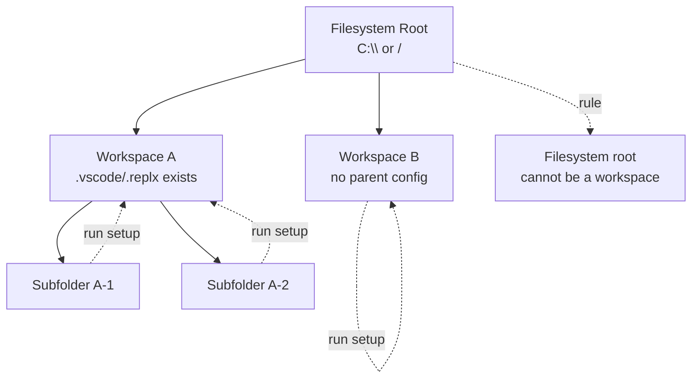
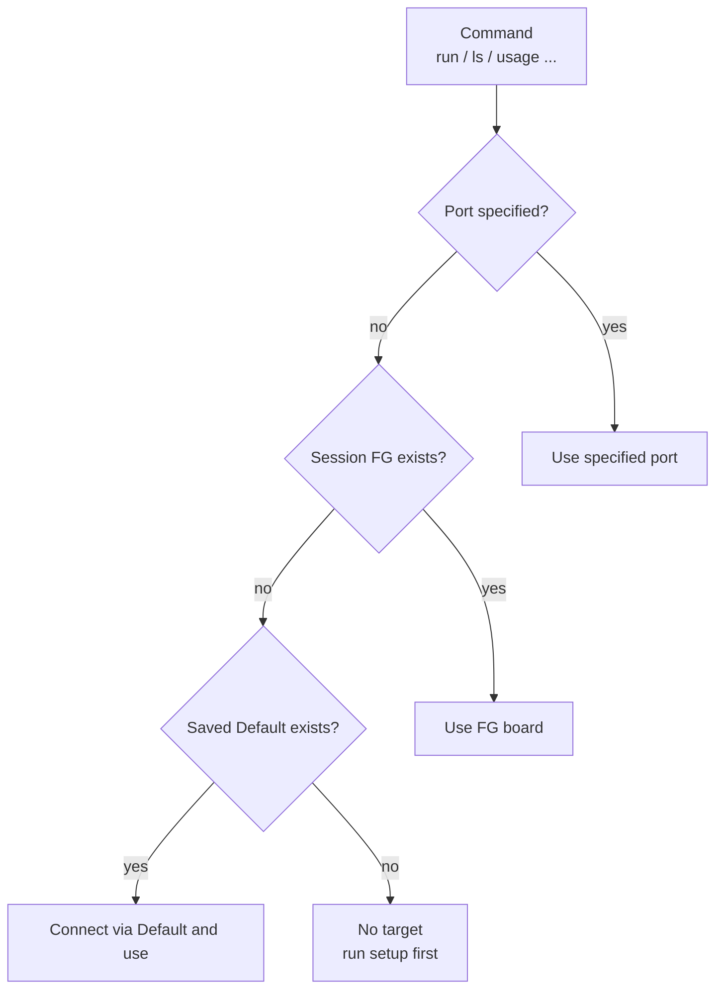

# replx

[](https://badge.fury.io/py/replx)
[](https://www.python.org/downloads/)
[](https://opensource.org/licenses/MIT)

`replx` is a CLI tool for MicroPython development that uses a single local agent-based architecture to connect and manage multiple CLI sessions and multiple boards, improving connection efficiency and enabling parallel workflows.

---

## Core Architecture


```mermaid
flowchart LR
  CLI1[replx CLI A] <-->|UDP/IPC| AGENT[Agent Server]
  CLI2[replx CLI B] <-->|UDP/IPC| AGENT
  CLIN[replx CLI N] <-->|UDP/IPC| AGENT
  AGENT <-->|Serial| DEV1[Board A]
  AGENT <-->|Serial| DEV2[Board B]
  AGENT <-->|Serial| DEVN[Board N]

  BG[Single Local Background Process]:::note -.-> AGENT

  classDef note fill:#f8f9fa,stroke:#c9ccd1,color:#444;
```

Each CLI command communicates with a background Agent Server over UDP/IPC. The Agent Server handles all serial communication with the boards. This design allows multiple terminal sessions to share connection state while consistently handling FG/BG switching, status queries, and command execution.

### Agent Process and Port

- `replx` uses one local Agent Server per PC.
- The agent listens on a UDP port selected from `49152-65535`.
- The selected port is stored in `~/.replx/.agent_port` and reused by later CLI commands.
- If the stored port is occupied by another program and no replx agent is running there, replx selects a new free port and updates `~/.replx/.agent_port`.

### Session / FG / BG / Default

- **Session (SID)**: A unique work context created per terminal
- **FG (Foreground) connection**: The board used as the default target in the current session
- **BG (Background) connection**: Additional boards attached to the same session alongside FG
- **Default connection**: Board info saved by `setup`, reused when no port is specified


```mermaid
flowchart TB
  SID[Session SID]
  FG[FG Board<br/>Default board for session]
  BG1[BG Board 1]
  BG2[BG Board 2]
  DEF[Default Connection<br/>saved by setup]

  SID --> FG
  SID --> BG1
  SID --> BG2
  DEF -. Used when no FG exists .-> FG
```

Key rules:

1. A session can have **one FG + multiple BG** boards.
2. The FG board can be used without specifying a port in most commands.
3. To target a BG board, the port must be specified explicitly.
4. After `setup`, the saved default connection makes port-omitted execution straightforward.

### setup and Workspace Scope

`setup` is not just a connect command — it initializes the development environment relative to the **current VS Code workspace**.


```mermaid
flowchart TB
  ROOT[Filesystem Root<br/>C:\\ or /]
  WSA[Workspace A<br/>.vscode/.replx exists]
  WSB[Workspace B<br/>no parent config]
  SUB1[Subfolder A-1]
  SUB2[Subfolder A-2]
  NOTE_ROOT[Filesystem root<br/>cannot be a workspace]

  ROOT --> WSA
  ROOT --> WSB
  WSA --> SUB1
  WSA --> SUB2

  SUB1 -. run setup .-> WSA
  SUB2 -. run setup .-> WSA
  WSB -. run setup .-> WSB
  ROOT -. rule .-> NOTE_ROOT
```

1. Running `setup` configures MicroPython type hints, VS Code settings, and the default port (Default connection) for that workspace.
2. The filesystem root (`C:\`, `/`) cannot be used as a workspace.
3. A workspace can contain subfolders — running `setup` from a subfolder applies settings to the parent workspace scope.
4. If no workspace config exists in a parent path, each subdirectory is treated as an independent workspace with its own default port.

### Which board does a command target?

General commands (`run`, `ls`, `usage`, etc.) resolve the target board using the following flow:


```mermaid
flowchart TB
  CMD[Command<br/>run / ls / usage ...]
  HASPORT{Port specified?}
  HASFG{Session FG exists?}
  HASDEF{Saved Default exists?}
  USEPORT[Use specified port]
  USEFG[Use FG board]
  USEDEF[Connect via Default and use]
  ERR[No target<br/>run setup first]

  CMD --> HASPORT
  HASPORT -- yes --> USEPORT
  HASPORT -- no --> HASFG
  HASFG -- yes --> USEFG
  HASFG -- no --> HASDEF
  HASDEF -- yes --> USEDEF
  HASDEF -- no --> ERR
```

1. If a port is specified in the command, that port takes priority.
2. Otherwise, the session's FG board is used.
3. If no FG exists, a connection is attempted using the saved Default.

The recommended approach: **use `setup` to make a board the default**, and only specify a port when needed.

Both of the following forms work identically:

- `replx --port PORT setup`
- `replx PORT setup` (shorthand)

`PORT` depends on the OS:
- Windows: `COM4`
- Linux: `/dev/ttyACM0` or `/dev/ttyUSB0`
- macOS: `/dev/cu.usbmodem14101` or `/dev/cu.usbserial-0001`

### Two command groups

#### Commands that work without a port
These commands are primarily for querying or managing state, not direct board interaction. They operate independently or based on session context. Using `-p/--port` with these commands is an error.

- `replx scan` — discover connectable boards (no connection made)
- `replx status` — check session/FG/BG connection state
- `replx whoami` — show the FG board for the current session
- `replx shutdown` — shut down the agent and all connections
- `replx --help`, `replx COMMAND --help` — help
- `replx -v` — version

#### Commands that require a board connection
These commands communicate with the board. Except for `setup`, the port can be omitted if an FG or Default connection exists.

- Connection/session: `setup`, `fg`, `disconnect`
- Execution/interaction: `exec`, `run`, `repl`, `shell`
- Files: `ls`, `cat`, `get`, `put`, `cp`, `mv`, `rm`, `mkdir`, `touch`
- Board: `usage`, `reset`, `format`, `init`, `wifi`, `firmware`
- Package/compile: `pkg`, `mpy`

---

### Usage Scenarios

#### Scenario #1 — Start a new project
1. Run `replx scan` to identify the port
2. Run `replx PORT setup` to initialize the workspace and save the default connection
3. Run `replx ls` to confirm basic operation

#### Scenario #2 — Multiple terminals / multiple boards
1. Connect the required boards from terminals A and B
2. Run `replx status` to check FG/BG state per SID
3. Use `replx fg` or `replx PORT fg` to switch as needed

#### Scenario #3 — Quick code experimentation
- One-liner: `replx -c "print('hello')"`
- Run a file: `replx run app.py`
- Start REPL: `replx repl`

#### Scenario #4 — File and library management
- File sync: `put/get/ls/cat/...`
- Interactive file shell: `replx shell`
- Library update: `replx pkg search` → `replx pkg download` → `replx pkg update core.all`

#### Scenario #5 — End of session / cleanup
- Release port only: `replx disconnect`
- Full shutdown: `replx shutdown`

---

## Command Reference

### Command Summary

#### Connection / Session

| Command | Description |
|---|---|
| `setup` | Register the board as the default target and initialize the development environment. |
| `scan` | Discover available ports and board information. |
| `status` | Show FG/BG connection state per session. |
| `fg` | Switch the FG board for the current session. |
| `whoami` | Show the FG board the current session is targeting. |
| `disconnect` | Release the board connection for the current session. |
| `shutdown` | Shut down the agent and clean up all session connections. |

#### Execution / Interaction

| Command | Description |
|---|---|
| `exec` (`-c`) | Execute a short Python snippet immediately. |
| `run` | Run a local Python file on the board. |
| `repl` | Start an interactive REPL session. |
| `shell` | Open an interactive shell for board filesystem operations. |

#### File Operations

| Command | Description |
|---|---|
| `ls` | List files and directories at a board path. |
| `cat` | Print the contents of a board file. |
| `get` | Download a file or directory from the board to local. |
| `put` | Upload a local file or directory to the board. |
| `cp` | Copy files or directories within the board. |
| `mv` | Move or rename files or directories within the board. |
| `rm` | Delete files or directories on the board. |
| `mkdir` | Create a directory on the board. |
| `touch` | Create an empty file or update its timestamp. |

#### Board Management

| Command | Description |
|---|---|
| `usage` | Show storage and RAM usage with free space. |
| `reset` | Soft-reset the board. |
| `format` | Format the board filesystem. |
| `init` | Run initial setup scripts on the board. |
| `wifi` | Manage Wi-Fi configuration and connection state. |
| `firmware` | Check, download, or update board firmware. |

#### Package / Compile

| Command | Description |
|---|---|
| `pkg` | Search, download, and update MicroPython packages. |
| `mpy` | Compile `.py` files to `.mpy` bytecode. |

#### Hardware

| Command | Description |
|---|---|
| `gpio` | Read, write, and run GPIO sequences. |
| `pwm` | Generate and monitor PWM signals. |
| `adc` | Read ADC pins and run a board-side scope UI. |
| `uart` | Open, write, read, and monitor UART. |
| `spi` | Open, write, read, and transfer SPI data. |
| `i2c` | Scan, read, write, and dump I2C devices. |

---

### Connection / Session

#### `setup`
The first command to run when starting a new project. After confirming the board connection, it creates `.vscode/tasks.json`, `.vscode/settings.json`, and `.vscode/launch.json`, configures the Pylance typehint path, and saves the current port as the workspace Default. A port is required. Using `clean` clears all existing connection history and keeps only the current port.
Settings apply at the workspace level; running from a subfolder applies them to the parent workspace scope. If no config exists in a parent path, each path is treated as an independent workspace with its own default port.
The filesystem root (`C:\`, `/`) cannot be used as a workspace.

Usage:
```sh
replx PORT setup
replx PORT setup clean
```

Examples:
```sh
replx COM3 setup
replx /dev/ttyACM0 setup
replx /dev/cu.usbmodem14101 setup
replx COM3 setup clean
```

#### `scan`
Use this to identify which port belongs to which board before connecting. Combines already-connected agent ports with freshly scanned ports and displays Port / Version / Core / Device / Manufacturer along with connected and Default status.

Usage:
```sh
replx scan
```

Examples:
```sh
replx scan
replx COM3 setup                  # setup using port found by scan
replx /dev/ttyACM0 setup          # Linux example
replx /dev/cu.usbmodem14101 setup # macOS example
```

Notes:
- `scan` only detects boards; it does not establish a connection.
- Using `-p/--port` with `scan` is an error.

#### `status`
Use this in a multi-terminal environment to inspect FG/BG connections per session at a glance. Shows the current session, foreground/background ports for each session, and the default port.

Usage:
```sh
replx status
```

Examples:
```sh
replx status
replx fg                        # switch foreground after checking status
```

#### `fg`
Switch the foreground board for the current session. `replx fg` presents an interactive list to choose from; `replx PORT fg` immediately promotes the specified port to FG. Subsequent commands (`ls`, `run`, `cat`, etc.) will target the new FG board.

Usage:
```sh
replx fg
replx PORT fg
```

Examples:
```sh
replx fg
replx COM19 fg
replx /dev/ttyACM0 fg
replx /dev/cu.usbmodem14101 fg
```

#### `whoami`
Instantly shows what FG board the current terminal session is targeting.

Usage:
```sh
replx whoami
```

Examples:
```sh
replx whoami
replx COM3 fg && replx whoami   # confirm target after switching FG
```

#### `disconnect`
Disconnects a specific port while keeping the agent process running. `replx disconnect` targets the current session's FG; `replx PORT disconnect` releases the specified port. When a connection is released, it is removed from all sessions that were referencing it.
If the FG is removed, one of the BG boards becomes FG. If no ports remain, the agent shuts down.

Usage:
```sh
replx disconnect
replx PORT disconnect
```

Examples:
```sh
replx disconnect
replx COM3 disconnect
replx /dev/ttyACM0 disconnect
replx /dev/cu.usbmodem14101 disconnect
```

#### `shutdown`
Use this when you are done working and want to clean up sessions, connections, and the agent in one step. The result varies by state: `Shutdown Complete` on success, `Already Shutdown` if already stopped, `Shutdown Failed` on error. The agent will restart automatically the next time a command requires it.

Usage:
```sh
replx shutdown
```

Examples:
```sh
replx shutdown
replx shutdown && replx status  # confirm state after shutdown
```

---

### Execution / Interaction

#### `exec` (`-c` alias)
Run a short MicroPython snippet without a file. Sends the `exec` command to the board once and returns standard output immediately. Multiple statements can be chained with semicolons (`;`).

Usage:
```sh
replx exec "CODE"
replx -c "CODE"
```

Examples:
```sh
replx -c "print('hello')"
replx -c "import os; print(os.listdir())"
replx exec "import machine; print(machine.freq())"
replx -c "import time; time.sleep(1); print('done')"
```

#### `run`
The primary command for running scripts. Default mode transfers a local file to the board and runs it interactively. `-d/--device` runs a file already stored on the board interactively. `-n/--non-interactive` detaches execution without waiting for I/O. `-e/--echo` echoes input to the terminal during interactive runs. `--line text|hex` switches to line input mode: output scrolls in a split region while the input line stays fixed at the bottom. `--non-interactive` and `--echo` cannot be used together, and `--line` cannot be combined with either.

Usage:
```sh
replx run SCRIPT
replx run -d SCRIPT
replx SCRIPT
replx run --line text SCRIPT
replx run --line hex SCRIPT
```

Examples:
```sh
replx run main.py
replx main.py              # shorthand for .py files
replx run -d /test.py      # run board's /test.py interactively
replx run -n server.py     # non-interactive (no I/O wait)
replx run -dn /main.py     # run board's /main.py non-interactively
replx run --line text main.py   # line mode: type text, Enter to send
replx run --line hex main.py    # line mode: type hex bytes (e.g. 0102ff), Enter to send
replx main.py --line hex        # shortcut form also works
```

Line mode key bindings:
- `Enter`: send the typed line to the board
- `Backspace`: delete last character
- `Ctrl+U`: clear the input line
- `Ctrl+C` twice: interrupt and exit

#### `repl`
Enter the board's Friendly REPL to experiment with code line by line. Output is displayed in real time. Type `exit()` to end the REPL session.

Usage:
```sh
replx repl
```

Examples:
```sh
replx repl
# Inside REPL:
>>> import os
>>> os.listdir()
>>> exit()
```

Key bindings:
- `Ctrl+C`: interrupt running code
- `Ctrl+D`: soft reset

#### `shell`
An interactive shell for continuous board filesystem management. Supports `ls/cat/cp/mv/rm/mkdir/touch` and `cd/pwd` relative to the current path. This is not a Python REPL. Inside the shell, `run` always operates on board files (`-d` mode), and `-n/-e` options are unavailable.

Usage:
```sh
replx shell
```

Available commands inside the shell:
```sh
# Files
ls cat cp mv rm mkdir touch

# Navigation
cd pwd clear

# Execution
exec run repl

# Other
usage wifi help exit
```

Examples:
```sh
replx shell
:/ > ls
:/ > cd lib
:/lib > cat boot.py
:/lib > exit
```

---

### File Operations

#### `ls`
List the contents of a board directory. Default shows a single-path listing; `-r/--recursive` outputs the full tree. Folder/file type icons and size information are shown, making it useful for pre/post-deploy comparisons.

Usage:
```sh
replx ls [PATH]
replx ls -r [PATH]
```

Examples:
```sh
replx ls
replx ls /lib
replx ls -r
replx ls -r /lib
```

#### `cat`
View the contents of a board file. Text files are shown as-is; binary files are displayed as a hex dump. `-n/--number` adds line numbers for text. `-L/--lines` selects a line range (`N:M`) for text or a byte range (`N:M`, `N:+M`) for binary.

Usage:
```sh
replx cat FILE
replx cat -n FILE
replx cat -L N:M FILE
```

Examples:
```sh
replx cat main.py
replx cat -n /lib/audio.py
replx cat -L 1:30 boot.py
replx cat -L 100:+64 app.mpy
```

#### `get`
Download files or directories from the board to local. Remote patterns (`*`, `?`) are resolved on the board side; directories are downloaded recursively. When downloading multiple sources, the last argument `LOCAL` must be a directory.

Usage:
```sh
replx get REMOTE LOCAL
replx get REMOTE... LOCAL
```

Examples:
```sh
replx get main.py ./
replx get / ./backup            # full board filesystem backup
replx get /a.py /b.py ./
replx get /lib/*.mpy ./compiled
```

#### `put`
Upload local files or directories to the board. Local wildcards (`*`, `?`) are expanded before upload; directories are transferred recursively. The last argument is always the remote destination path; remote directories are created automatically if needed.

Usage:
```sh
replx put LOCAL REMOTE
replx put LOCAL... REMOTE
```

Examples:
```sh
replx put main.py /
replx put ./lib/audio.py /lib
replx put a.py b.py /lib
replx put *.py /lib
```

#### `cp`
Copy files or directories within the board. Supports single files, directories, multiple sources, and patterns. `-r/--recursive` is required for directories; the destination must be a directory when copying multiple sources.

Usage:
```sh
replx cp SRC DEST
replx cp -r DIR DEST
```

Examples:
```sh
replx cp /main.py /backup.py
replx cp x.py y.py /backup
replx cp /lib/*.mpy /backup
replx cp -r /lib /lib_backup
```

#### `mv`
Move or rename files and directories within the board. Supports single moves, multiple sources, and patterns. `-r/--recursive` is required for directories. When moving multiple sources, verify the destination is a directory first.

Usage:
```sh
replx mv SRC DEST
replx mv -r DIR DEST
```

Examples:
```sh
replx mv /old.py /new.py
replx mv /main.py /backup
replx mv *.py /backup
replx mv -r /lib/audio /lib/sound
```

#### `rm`
Delete files or directories on the board. By default, a confirmation prompt is shown before deletion; `-f/--force` skips the prompt. `-r/--recursive` is required for directories. Pattern deletion (`*.py`, `/lib/*.mpy`) is supported.

Usage:
```sh
replx rm FILE
replx rm -r DIR
replx rm -f FILE
```

Examples:
```sh
replx rm /main.py
replx rm -f /main.py
replx rm /a.py /b.py
replx rm /lib/*.mpy
replx rm -rf /tmp
```

#### `mkdir`
Pre-create a directory structure on the board. Multiple paths can be created at once, including nested paths. Existing directories are silently retained.

Usage:
```sh
replx mkdir DIR
replx mkdir DIR...
```

Examples:
```sh
replx mkdir /lib
replx mkdir /tests
replx mkdir /lib/audio /lib/net
replx mkdir /a/b/c
```

#### `touch`
Create an empty file or ensure a file exists. Useful for setting up initial project templates with multiple files at once.

Usage:
```sh
replx touch FILE
replx touch FILE...
```

Examples:
```sh
replx touch /config.py
replx touch /a.py /b.py /c.py
replx touch /lib/__init__.py
```

---

### Board Management

#### `usage`
Check RAM (`mem`) and filesystem (`df`) usage simultaneously. Shows a usage bar alongside Used/Free/Total values, making it ideal for capacity checks before uploading.

Usage:
```sh
replx usage
replx PORT usage
```

Examples:
```sh
replx usage
replx COM3 usage
replx /dev/ttyACM0 usage
replx /dev/cu.usbmodem14101 usage
```

#### `reset`
Reset the board's execution state. Default is `--soft` (restart the interpreter); `--hard` performs a hardware reset followed by automatic reconnection. Using `--soft` and `--hard` together is an error.

Usage:
```sh
replx reset
replx reset --soft
replx reset --hard
```

Examples:
```sh
replx reset
replx reset --soft
replx reset --hard
```

Options:
- `--soft`: restart the Python interpreter (default)
- `--hard`: hardware reset + auto-reconnect

#### `format`
Completely wipe the board filesystem and start fresh. All user files including `boot.py`, `main.py`, and `lib/` are deleted. Some boards may not support the format command — check the error message if it fails.

Usage:
```sh
replx format
```

Examples:
```sh
replx get /*.py ./backup
replx get /lib ./backup
replx format
```

#### `init`
Restore a board to its initial state and reinstall required libraries. Internally runs `format` followed by sequential core/device package installation. The local package store must be prepared first — run `replx pkg download` before using this for the first time.

Usage:
```sh
replx init
```

Examples:
```sh
replx pkg download
replx init
```

Operation order:
1. Format filesystem
2. Install core libraries
3. Install device libraries

#### `wifi`
Manage the board's Wi-Fi status, connection, and boot auto-connect. `wifi connect SSID PW` saves credentials to the board (`wifi_config.py`) and connects immediately. `wifi connect` reconnects using saved settings. `wifi boot on|off` controls whether `boot.py` auto-connects on startup.

Usage:
```sh
replx wifi
replx wifi connect SSID PW
replx wifi connect
replx wifi scan
replx wifi off
replx wifi boot on|off
```

Examples:
```sh
replx wifi
replx wifi scan
replx wifi connect MySSID MyPassword
replx wifi connect
replx wifi boot on
replx wifi off
```

#### `firmware`
Download firmware locally or update via UF2 for supported boards. `download` only refreshes the local store; `update` puts the board into bootloader mode, locates the UF2 drive, and installs the firmware. `-f/--force` reinstalls even when the version matches. Currently officially supported boards: `ticle-lite`, `ticle-sensor`.

Usage:
```sh
replx firmware download
replx firmware update
replx firmware update -f
```

Options:
- `-f, --force`: force reinstall even if version is unchanged

Examples:
```sh
replx firmware download
replx firmware update
replx firmware update --force
```

---

### Package / Compile

#### `pkg`
Manages the package workflow (`search → download → update`) between the GitHub remote registry, local store, and board. `search [QUERY]` shows results scoped to the connected board's core/device. `download` fetches the remote registry to the local store. `update TARGET` installs packages to the board using `core.all`, `device.all`, `core.<file>`, `device.<file>`, or URL format. `clean` removes the current core/device entries from the local store. `--owner/--repo/--ref` specify the GitHub remote and apply to `search/download/update`. `-t/--target` specifies the board destination path for `update`.

Usage:
```sh
replx pkg SUBCOMMAND [args]
```

Examples:
```sh
replx pkg search
replx pkg search audio
replx pkg search --owner PlanXLab --repo replx_libs --ref main
replx pkg download
replx pkg download --owner PlanXLab --repo replx_libs --ref main
replx pkg update core.all
replx pkg update device.all
replx pkg update core.slip.py
replx pkg update device.termio.py
replx pkg update core.termio.py --target lib/ext
replx pkg update https://raw.githubusercontent.com/.../driver.py --target lib/ext
replx pkg clean
```

> Note: `pkg search/download/update` operates within the **core/device scope of the currently connected board**.

#### `mpy`
Compile `.py` files to `.mpy` bytecode. Automatically selects the target architecture based on the connected board's `core` and version. `-o/--output` can only be used when compiling a single file. `mpy-cross` must be installed locally before use.

Usage:
```sh
replx mpy FILES...
replx mpy main.py -o out.mpy
```

Examples:
```sh
replx mpy main.py
replx mpy main.py -o build/main.mpy
replx mpy *.py
replx mpy src/
```

---

### Hardware

Hardware commands communicate with on-board peripherals through code generated and executed by the agent. Each command manages bus lifecycle (`open`/`close`), data transfer (`read`/`write`/`xfer`), and optional live monitoring. Pin names use the `GP<num>` format (case-insensitive). Bus settings are stored in agent memory until `close` or agent restart.

#### `gpio`
Read, write, and run sequences on a single GPIO pin. `read` performs a one-shot input read with optional actions (`wait_h`, `wait_l`, `pulse_h`, `pulse_l`). `write` drives the pin high or low. `seq` executes a write+delay pattern in a single board call. `monitor` samples the pin with IRQ edge capture and renders a live scope (requires `termviz` on the board).

Usage:
```sh
replx gpio PIN read [ACTION]
replx gpio PIN write VALUE
replx gpio PIN seq TOKEN...
replx gpio PIN monitor
```

Examples:
```sh
replx gpio GP0 read
replx gpio GP0 read pulse_h --timeout 500
replx gpio GP15 write 1
replx gpio GP15 seq 1 m500 0 m500 --repeat 10
replx gpio GP2 monitor --interval 5
```

Options:
- `--timeout MS`: action timeout (default: 100, 0 = unlimited)
- `--repeat N`: repeat count for `read`/`seq` (0 = unlimited, default: 1)
- `--interval MS`: monitor render interval (default: 10, min: 1)
- `--expr EXPR`: post-process expression; variables: `pulse_us`, `wait_ms`, `value`, `writes`

#### `pwm`
Generate PWM on a single pin. `write` starts or updates PWM with a frequency and one duty specification. `seq` runs a duty+delay pattern in one board call. `stop` halts PWM and drives the pin low. `monitor` measures PWM frequency and duty on an input pin using PIO (RP2350/RP2040) or `time_pulse_us` fallback.

Usage:
```sh
replx pwm PIN write --freq HZ --duty-percent P
replx pwm PIN seq --freq HZ --duty percent TOKEN...
replx pwm PIN stop
replx pwm PIN monitor
```

Examples:
```sh
replx pwm GP15 write --freq 1000 --duty-percent 50
replx pwm GP15 write --freq 50 --pulse-us 1500
replx pwm GP15 seq --freq 1000 --duty percent 0 m200 25 m200 50 m200 75 m200 100 m200
replx pwm GP15 stop
replx pwm GP16 monitor --timeout 5000
```

Options:
- `--freq HZ`: PWM frequency (required for `write`/`seq`)
- `--duty-percent P`: duty cycle 0–100 (`write`)
- `--duty-u16 N`: duty cycle 0–65535 (`write`)
- `--pulse-us US`: pulse width in microseconds (`write`)
- `--duty MODE`: duty basis for `seq` (`percent`, `u16`, `pulse_us`)
- `--repeat N`: seq repeat count (0 = unlimited, default: 1)
- `--timeout MS`: monitor signal timeout (default: 2000)

#### `adc`
Read analog pins or launch a board-side scope UI. `read` samples one to three ADC channels. `scope` runs an interactive waveform viewer on the board (requires `termviz` and `ufilter`).

Usage:
```sh
replx adc PIN... read
replx adc PIN... scope
```

Examples:
```sh
replx adc GP26 read
replx adc GP26 GP27 read --repeat 0 --interval 500
replx adc GP26 GP27 GP28 scope --sample 10
replx adc GP26 scope --vref 3.3
```

Options:
- `--repeat N`: read repeat count (0 = unlimited, default: 1)
- `--interval MS`: delay between repeated reads (default: 1000)
- `--vref V`: ADC reference voltage (default: 3.3)
- `--sample MS`: scope render speed (0, 1, 2, 5, 10, 20, 50, 100; default: 10)

#### `uart`
Manage a UART bus. `open` configures the bus; `write` sends text or hex bytes; `read` receives data; `xfer` writes then reads; `monitor` displays incoming data in real time; `bus` shows settings; `close` releases the peripheral.

Usage:
```sh
replx uart open --tx PIN [--rx PIN] [--baud N]
replx uart write DATA
replx uart read [NBYTES]
replx uart xfer DATA [--rx-bytes N]
replx uart monitor
replx uart bus
replx uart close
```

Examples:
```sh
replx uart open --tx GP0 --rx GP1 --baud 9600
replx uart write "AT\r\n"
replx uart write --hex 0102FF
replx uart read 16 --timeout 3000
replx uart read --any
replx uart xfer "AT\r\n" --rx-bytes 32
replx uart monitor --text
replx uart monitor --chunk --idle 100
replx uart close
```

Options:
- `--tx PIN`, `--rx PIN`: TX/RX pins (TX required for `open`)
- `--baud N`: baud rate (default: 115200)
- `--bits 7|8`, `--parity none|odd|even`, `--stop 1|2`: frame format
- `--timeout MS`: RX wait timeout (default: 2000, 0 = unlimited)
- `--any`: drain RX buffer immediately (`read` only)
- `--hex`: send hex bytes instead of text (`write` only)
- `--text`: stream UTF-8 (`monitor`)
- `--chunk`: per-chunk display with timestamp (`monitor`)
- `--idle MS`: silence separator threshold (`monitor`, default: 0 = off)

#### `spi`
Manage an SPI bus in master or slave mode. `open` configures the bus; `write`/`read`/`xfer` transfer data; `bus` shows settings; `close` releases the peripheral. `--slave` activates PIO+DMA slave mode (RP2350 only).

Usage:
```sh
replx spi open --sck PIN --mosi PIN [--miso PIN] [--baud N]
replx spi write DATA [--cs PIN]
replx spi read NBYTES [--cs PIN]
replx spi xfer DATA [--cs PIN]
replx spi bus
replx spi close
```

Examples:
```sh
replx spi open --sck GP2 --mosi GP3 --miso GP4 --baud 2000000
replx spi write 0102FF --cs GP5
replx spi read 8 --cs GP5 --fill FF
replx spi xfer 0102FF --cs GP5
replx spi open --sck GP2 --mosi GP3 --slave
replx spi close
```

Options:
- `--sck PIN`, `--mosi PIN`, `--miso PIN`: bus pins (SCK/MOSI required)
- `--cs PIN`: chip-select pin (slave: `open` only; master: `write`/`read`/`xfer`)
- `--baud N`: clock rate (default: 1000000)
- `--mode 0-3`: SPI mode (default: 0)
- `--bits 8|16`: word size (default: 8)
- `--lsb`: LSB-first bit order
- `--slave`: enable PIO+DMA slave mode (`open` only)
- `--fill HH`: fill byte for master `read` (default: 00)
- `--text`: text mode for `write`/`xfer`
- `--timeout MS`: slave RX timeout (default: 10000)

#### `i2c`
Manage an I2C bus in controller or target mode. `scan` discovers devices; `open` configures the bus; `read`/`write` transfer data; `dump` reads a register range; `seq` runs a write+delay sequence; `mem` reads the target memory buffer; `bus` shows settings; `close` releases the peripheral. `--target` activates I2CTarget mode (RP2350 only).

Usage:
```sh
replx i2c scan --sda PIN --scl PIN
replx i2c open --sda PIN --scl PIN [--freq HZ]
replx i2c read ADDR NBYTES [--reg REG]
replx i2c write ADDR DATA [--reg REG]
replx i2c dump ADDR [REG_START] [REG_END]
replx i2c seq ADDR TOKEN...
replx i2c bus
replx i2c close
```

Examples:
```sh
replx i2c scan --sda GP0 --scl GP1
replx i2c open --sda GP0 --scl GP1 --freq 400000
replx i2c read 0x68 6 --reg 0x3B
replx i2c read 0x68 6 --reg 0x3B --repeat 5 --interval 100
replx i2c write 0x68 00 --reg 0x6B
replx i2c dump 0x68
replx i2c dump 0x68 0x3B 0x48
replx i2c seq 0x68 6B00 m100 3B:6
replx i2c open --sda GP0 --scl GP1 --target --addr 0x55 --mem-size 256
replx i2c mem
replx i2c close
```

Options:
- `--sda PIN`, `--scl PIN`: I2C pins (required for `scan`/`open`)
- `--freq HZ`: clock frequency (default: 400000)
- `--reg REG`: register address for `read`/`write`
- `--addr16`: use 16-bit register addresses
- `--target`: enable I2CTarget mode (`open` only, RP2350)
- `--addr 0xNN`: target address (`open --target`)
- `--mem-size N`: target memory buffer size (`open --target`)
- `--repeat N`: repeat count for `read`/`seq` (0 = unlimited, default: 1)
- `--interval MS`: delay between repeats (default: 0)

---

## Troubleshooting

#### Connection / Session

| Symptom | Likely Cause | Resolution |
|---|---|---|
| `No active connections` | `setup` not run, agent stopped | `replx scan` → `replx PORT setup` → `replx status` |
| `Not connected` | No FG in current session | Check SID with `replx status`, then run `replx fg` or `replx PORT fg` |
| Board shows busy in another terminal | Another SID has it as FG/BG | Finish work in that terminal, or `disconnect`; use `shutdown` if needed |
| Port remains occupied | Agent still running | `replx disconnect` (individual) or `replx shutdown` (all) |

#### Execution (`exec/run/repl/shell`)

| Symptom | Likely Cause | Resolution |
|---|---|---|
| `run` fails immediately | Wrong file path | Local file: `run file.py`; board file: `run -d /path/file.py` |
| `--non-interactive` and `--echo` conflict | Invalid option combination | Use only one of the two |
| Hard to exit REPL | Unaware of exit method | Type `exit()` or press `Ctrl+D` |
| Unexpected path in shell | Current directory confusion | Check with `pwd`, navigate with `cd` |

#### File Operations

| Symptom | Likely Cause | Resolution |
|---|---|---|
| Wildcard behaves unexpectedly | Local vs. board expansion difference | `put` expands locally; `get/rm/cp/mv` resolve patterns on the board |
| Directory copy/move fails | Missing `-r` | Use `cp -r`, `mv -r`, `rm -r` |
| Multiple sources but destination is a file | Misunderstanding of last-arg rule | The last argument is always DEST; it must be a directory for multiple sources |
| Cannot recover after deletion | No backup | Back up with `replx get` before deleting |

#### Package / Compile

| Symptom | Likely Cause | Resolution |
|---|---|---|
| No `pkg search` results | Outside current board's core/device scope | Check board with `whoami`, switch board and search again |
| `pkg update` fails | Local store not prepared | Run `replx pkg download` first, then retry `replx pkg update ...` |
| `mpy` fails | `mpy-cross` not installed | `pip install mpy-cross` |
| Architecture error | Missing board connection info | Ensure connection is established (`setup` or auto-connect) |

#### Format / Init / Firmware

| Symptom | Likely Cause | Resolution |
|---|---|---|
| Files lost after `format/init` | Expected behavior (full wipe) | Back up with `get` before formatting; restore with `put`/`pkg update` |
| `firmware` unsupported error | Board not supported | Confirm board is a supported model (`ticle-*` series) |
| `wifi connect` fails | Wrong SSID/PW, AP not visible | `wifi scan` → re-enter credentials → try `wifi off` then retry |

#### Hardware

| Symptom | Likely Cause | Resolution |
|---|---|---|
| `open` fails with pin error | Invalid pin for the board's channel mapping | Check pin constraints: RP2350 I2C requires SCL=SDA+1; SPI slave requires MOSI=SCK+1 |
| `EFR32MG` not supported | I2C/SPI/PWM commands do not support EFR32MG | Use a supported core (RP2350, ESP32, Teensy) |
| `monitor`/`scope` shows nothing | Missing board-side library | Install `termviz` (gpio/adc) or `ufilter` (adc scope) via `replx pkg` |
| Slave/Target mode fails | Board not supported | PIO-based slave/target modes require RP2350 or RP2040 |
| `seq` timeout | Sequence too long for default timeout | Increase `--timeout MS` or set to 0 for unlimited |

---
